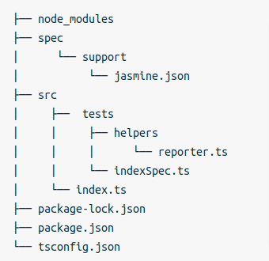

# Install Jasmine
- npm i --save jasmine
- npm i --save jasmine-spec-reporter
- npm i --save-dev @types/jasmine
# Add Testing Scripts
- package.json: "test": "jasmine"
# Cau truc thu muc
├── node_modules
├── spec
│      └── support
│           └── jasmine.json
├── src
│     ├──  tests
│     │     ├── helpers
│     │     │      └── reporter.ts
│     │     └── indexSpec.ts
│     └── index.ts
├── package-lock.json
├── package.json
└── tsconfig.json

